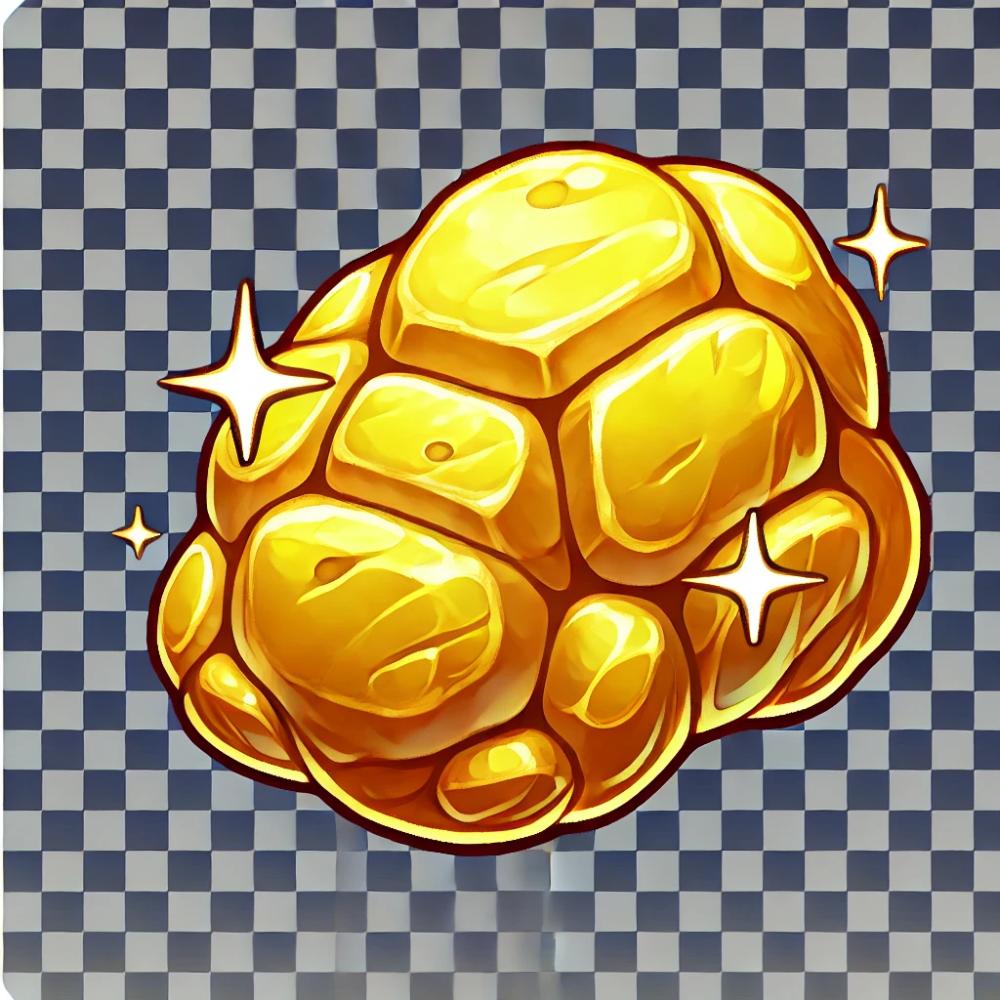
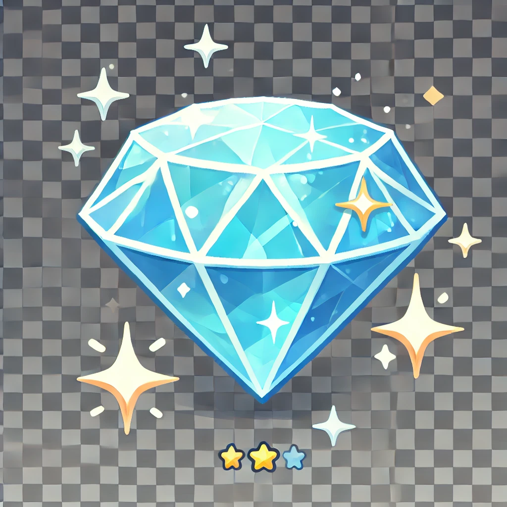
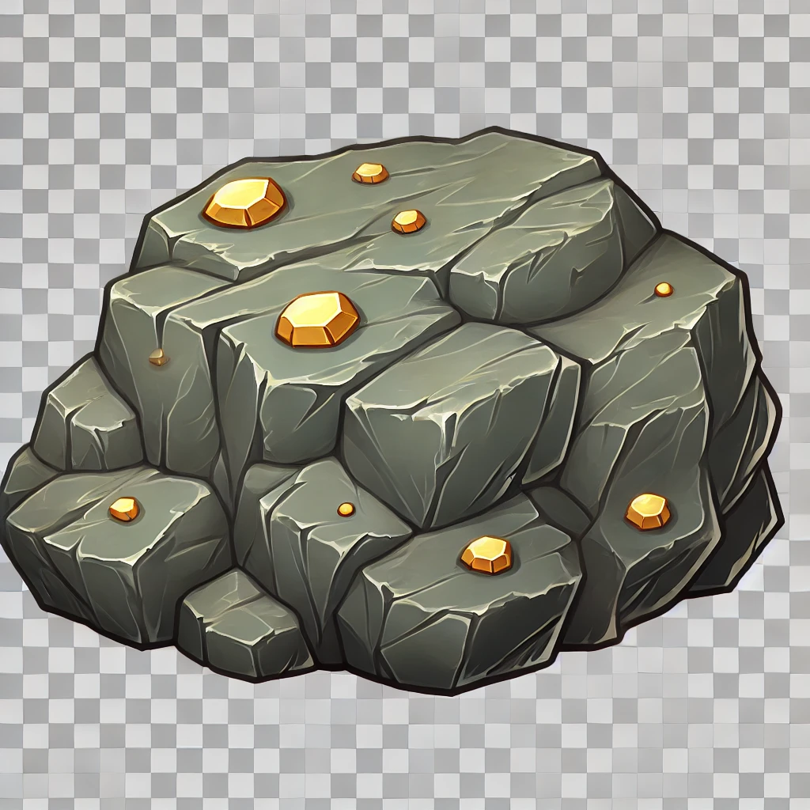

# GOLD MINER - README

## תיאור המשחק

במשחק GOLD MINER, השחקן משחק ככורה זהב המנסה לאסוף פריטים במפה באמצעות וו מתכת. הוו מסתובב בזווית מוגבלת, ובלחיצה השחקן שולח את הוו כדי לתפוס פריטים שונים. לכל פריט ערך שונה
---

## אובייקטים במשחק

### 1. **דמות השחקן**
- דמות הכורה מוצבת בחלק העליון של המשחק.
- הדמות קבועה במקום אך שולטת בוו המתכת.
- **תמונה:** 
### 2. **הוו**
- מסתובב בטווח של 180 מעלות בלבד (כלפי מטה).
- נשלח על ידי השחקן (לחיצה על מקש Space) לאיסוף פריטים.
- חוזר אוטומטית לנקודת ההתחלה לאחר שהגיע למרחק מקסימלי או לאחר שתפס פריט.
- **תמונה:** 

### 3. **חוט המתכת**
- מחבר את הוו לדמות השחקן.
- **טכנולוגיה:** נוצר באמצעות רכיב **LineRenderer** שמתעדכן בזמן אמת.

### 4. **פריטים מתחת לאדמה**
- **זהב:** פריט יקר ערך המוסיף ניקוד גבוה.
- **יהלום:** הפריט היקר ביותר במשחק.
- **אבן:** פריט זול המאט את מהירות החזרה של הוו.
- **תמונה:** כל פריט מעוצב בצורתו הייחודית (זהב, יהלום, אבן).

---

## איך המשחק עובד?

1. השחקן שולט בוו בעזרת סיבוב לכיוון הרצוי (בין -90 ל-90 מעלות).
2. לחיצה על מקש **Space** שולחת את הוו לאסוף פריטים.
3. אם הוו תופס פריט, הוא גורר אותו חזרה לדמות השחקן.
4. הפריט שנאסף מושמד, והניקוד של השחקן מתעדכן בהתאם לערכו.

---

## קודים במשחק

### 1. **HookController**
- מנהל את תנועת הוו:
  - סיבוב בטווח 180 מעלות.
  - תנועה בקו ישר לכיוון אליו הוו פונה.
  - חזרה לנקודת ההתחלה.
- מחבר את הוו לדמות באמצעות **LineRenderer**.

### 2. **ScoreUI**
- אחראי על הצגת הניקוד בפינה העליונה של המסך.
- מתעדכן בזמן אמת עם איסוף פריטים.

### 3. **Item**
- אחראי על הפריטים במשחק:
  - יצירת פריטים במיקומים רנדומליים.
  - הגדרת ערכי הניקוד עבור כל פריט (זהב, יהלום, אבן).
  - השמדת פריטים לאחר שנאספו.

---

## תכונות מיוחדות

- **חוט ריאליסטי:** חוט שמחבר את הוו לדמות השחקן ומתעדכן בזמן אמת.
- **סיבוב וו מוגבל:** טווח סיבוב שמעניק תחושה ריאליסטית.
- **גרפיקה ייחודית:** תמונות מעוצבות לכל דמות ואובייקט במשחק.

---

🎮 **משחק מהנה!**

